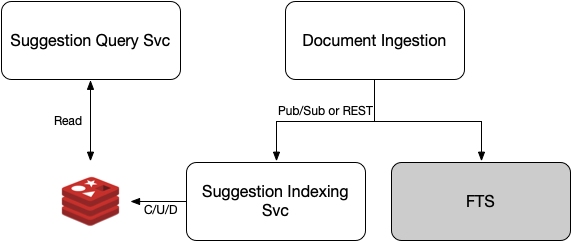

# Wikipedia Search Suggestions

## Service Architecture


## Data Architecture
The problem of matching inputs to known query strings lends itself nicely to the use of a trie. However, manually implementing and maintaining all the concerns related to a trie carries unnecessary risk. Redis can be used to accomplish the same thing and is a robust, tested, and efficient tool offering many operations at O(1) or O(log(n)).

### Key Components
* A Redis hash over the set of possible search suggestions
* A Redis hash providing a reverse lookup of suggestions to their keys
* Many Redis sets representing the possible prefixes of all words included in the suggestion hash
* (Optional) A Redis hash for each registered user containing user specific metrics for ranking

For brevity in the rest of this document these will be referred to as SHash, RHash, PSets, and UHash, respectively.

#### SHash
The basic structure of the SHash would be as follows:

```
Key: qs:phrases
Hash: <incrementing index> -> { "phrase": "<phrase string>", "lastused": <unixtimestamp>, "count": <64-bit integer>}
```


For example, a possible entry in the `qs:phrases` hash would be:

```
1 -> { "phrase": "psychology", "lastused": 1706707287, "count": 33957 }
```


#### RHash
The structure of the RHash is quite simple:

```
Key: qs:rev.phrases
Hash: "<phrase string>" -> <index in qs:phrases hash>
```

Using the same example as above, the corresponding entry would be:

```
"psychology" -> 1
```

#### PSets
To mimic a trie, the PSet keys will consist of all relevant prefixes for all relevant words in the SHash. To determine relevance the following rules will be used:

* A list of "stop words" will be maintained to exclude trivial words from prefix generation (e.g. "the", "an", "of", etc)
* No prefix of size less than 3
* Optionally, stemming and lemmatization techniques can be used reduce the number of words stored, but analysis on the impact of this strategy on accuracy would need to be done.

The structure of a PSet is:

```
Key: qs:prefix:<prefix>
Values: [<SHash Index>, <SHash Index>, ...]
```

For example, if our SHash contains the following:

```
1 -> { "phrase": "psycology", ... }
2 -> { "phrase": psycologist", ... }
```

The following PSets would be the result:

```
suggestions:prefixes:psy
suggestions:prefixes:psyc
suggestions:prefixes:psyco
suggestions:prefixes:psycol
suggestions:prefixes:psycolo
suggestions:prefixes:psycolog
suggestions:prefixes:psycology
suggestions:prefixes:psycologi
suggestions:prefixes:psycologis
suggestions:prefixes:psycologist
```

Where each PSet would have the value set: `[1, 2]`.

## Algorithms
The overview of algorithms and their complexities is provided [here](./Algorithms.md). For reference, the algorithms defined are:

* [Initial Seed](./InitialSeed.md)
* [Add Entry](./AddEntry.md)
* [Documenet Removal](./DocumentRemoval.md)
* Document Update ([Delete](./DocumentRemoval.md) + [Add](./AddEntry.md))
* [Suggestion Lookup](./SuggestionLookup.md)

## Workflow Overview
To provide adequate performance and scalability, the command and query responsibilities will be segregated into distinct services, scalable independently. The `Suggestion Lookup` algorithm will be the only function of the `Suggestion Query Service` in the architecture diagram above.  This is the only service that user interaction is dependent on and is the only service constrained by the SLA.  

Never-the-less, index updates should still be as fast as possible to avoid delays in relevant data being made available to users. As such, effort must be taken to ensure the `Add Entry`, `Document Update` and `Document Removal` algorithms are as fast as possible without sacrificing performance of the `Suggestion Lookup` algorithm due to data structure implications.  These three algorithms are the responsiblity of the `Suggestion Indexing Service` in the architecture diagram above. It is expected that new phrases will be provided to the service in the following scenarios:

* The title of new documents added to the search index
* The old and new titles of documents who's titles have changed in the search index
* Search queries submitted by users

## Assumptions
This document only concerns itself with detailing services, algorithms, and data structures relevant to providing search suggestions.  It is assumed that a full-text search solution is available elsewhere in the system to satisfy completed, submitted search queries.

## Future Enhancements
While a data structure for providing information to facilitate user specific relevance was mentioned above (UHash), no further exploration of this idea is provided here.  Such an enhancement can be expounded upon and refined as a team and then fully documented when the approach is finalized.

No effort was made to expire or remove stale or unused data. Nor was any effort made to constrain the growth of access counts. Both topics are discussed below in Scaling Concerns. In any case, improvement in both of these areas is left as a future enhancement, if needed.

## Scaling and Performance Concerns
There are multiple dimensions of scaling and performance concerns to consider. It is likely that not all possible bottlenecks are identified here. For both the identified and unidentified constraints, testing is required to fully quantify effectiveness of the design and ensure SLAs are met.  With this in mind, the concerns factored into the design are:

* Overall data size
* Responsiveness to user action
* Responsiveness to external data changes
* Overall data growth through usage
* Elasticity of the system under sustained traffic growth
* Resiliency of the system
* Cost

While a full exploration of all of these topics is beyond the scope of this document, briefly:

### Resilience & Elasticity
Regarding Resiliency and Elasticity, Redis scales very well both horizontally and vertically and the design of the custom services allows for both to be scaled independently, both horizontally and vertically, as needed. Effective load balancing should eliminate any concerns about service failure and allow for dynamic scaling based upon demand. The only effective limit to this scaling is cost.

### Data Size & Growth
Regarding data size and growth, much analysis was done of Wikipedia's title lengths, average English word lengths, the number of words in the English language, and the sizes of the various data types involved. While more concrete numbers can be provided, in summary, all of the data relevant to a corpus of 50M documents, in English, should easily fit into the memory of a very reasonably sized Redis instance. For resiliency and elasticity purposes, multiple instances may be desired, either in a cluster configuration or as hot-backups, but they should not be strictly required to hold the data, including growth.  However, the data size should be monitored and if needed a cleanup job to expunge stale data on a regular interval can be easily added.

### Responsiveness
The algorithms and data structure described above were specifically designed to minimize the number of elements involved in loops and sorts. This provides for a very fast interaction with the custom service and places the concern regarding latency on Redis. Redis is well documented to have latency measured in microseconds even against very large data stores. Given the usage of keys, hashes, and sets in the design above, performance should easily fall into the ideal zone for Redis. Care should be taken to avoid ill-advised Redis deployments, such as running in virtualized environments or shared servers with high workloads independent from Redis. Also, network latency between the custom services and Redis is a concern, but co-located deployment in a cloud provider's infrastructure should allow for the minimization of this concern. Further, if needed, small tweaks can be made to shift more of the algorithmic load to Redis and then leverage the cache like behavior available in Redis to minimize response time even further in the average case. Given the design considerations above, this seemed like premature optimization, so it is left for future enhancement if needed.

### Cost
There are numerous options for deployment in clould providers such as AWS with a broad spectrum of cost profiles. Quantifying hardware requirements through testing of the design should help inform the deployment characteristics and cost profile.  Having said that, an initial estimate including assumptions would suggest a cost somewhere on the order of $3000 / month for the initial deployment using AWS reserved instances and a simple EC2 + MemoryDB deployment. Though it may be possible to optimize that cost significantly.